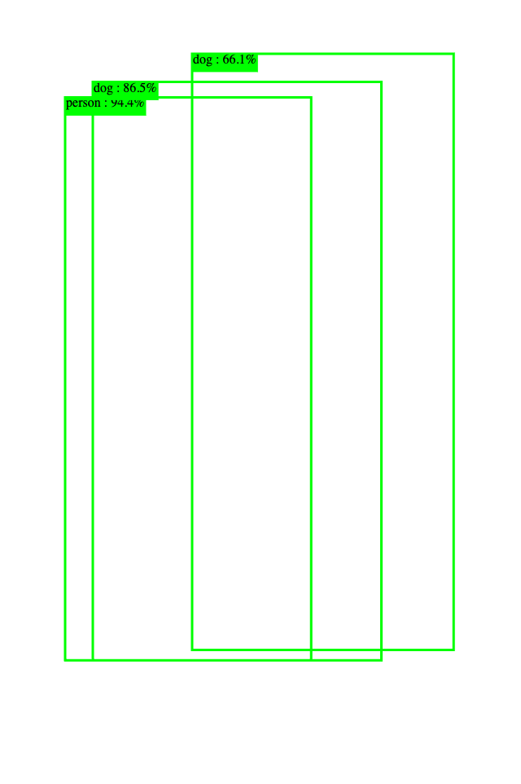

## Deploy on Code Engine

[Original instructions](https://hub.docker.com/r/codait/max-object-detector#deploy-on-code-engine)

You can also deploy the model on IBM Cloud's Code Engine platform which is based on the Knative serverless framework. Once authenticated with your IBM Cloud account, run the commands below.

Install IBMCLOUD client:

https://cloud.ibm.com/docs/cli?topic=cli-getting-started

IBM Code Engine:
https://cloud.ibm.com/containers/overview

Login to your IBM cloud account

```
ibmcloud login
```

Install Cloud Engine pluging:
```
ibmcloud plugin install code-engine
```

Create a Code Engine project, give it a unique name

```bash
ibmcloud ce project create --name sandbox
```

Run the container by pointing to the quay.io image and exposting port 5000.

```bash
ibmcloud ce application create --name max-object-detector --image quay.io/codait/max-object-detector --port 5000
```

Open the resulting URL in a browser, append /app to view the app instead of the API.

or try with

```bash
curl -F "image=@./dog-human.jpg" -XPOST https://max-object-detector.*****/model/predict | jq
```

You will see:
```bash
% Total    % Received % Xferd  Average Speed   Time    Time     Time  Current
                                 Dload  Upload   Total   Spent    Left  Speed
100  123k  100   379  100  122k      1    518  0:06:19  0:04:02  0:02:17   108
{
  "status": "ok",
  "predictions": [
    {
      "label_id": "1",
      "label": "person",
      "probability": 0.9440352320671082,
      "detection_box": [
        0.12420997023582458,
        0.12507186830043793,
        0.8423266410827637,
        0.5974075198173523
      ]
    },
    {
      "label_id": "18",
      "label": "dog",
      "probability": 0.8645510077476501,
      "detection_box": [
        0.1044766902923584,
        0.17799147963523865,
        0.8422800898551941,
        0.7320016622543335
      ]
    }
  ]
}
```




or 
Click on:

```bash
https://max-object-detector.***/app/
```
